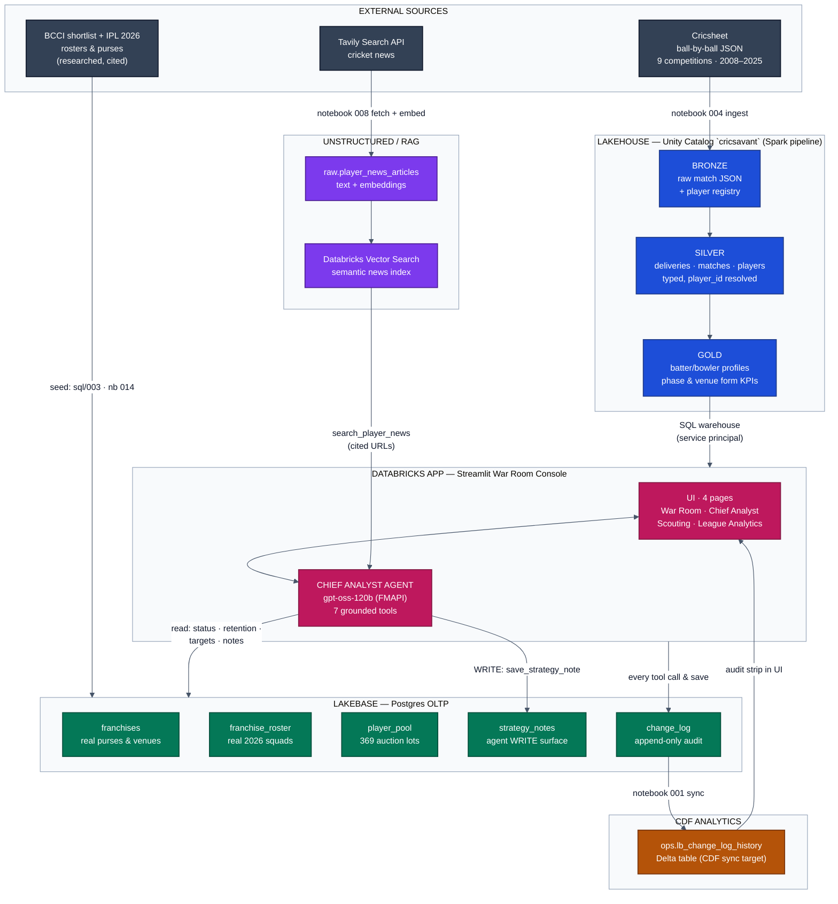

# CricSavant AI — Architecture

**IPL Franchise Strategy Platform on Databricks Free Edition.**
Every layer below runs inside one Databricks workspace; the only external
dependencies are Cricsheet (ball-by-ball data), Tavily (news retrieval), and
GitHub (deployment source).

## System diagram

**Legend:** slate = external sources · blue = Spark medallion (Lakehouse) ·
purple = unstructured/RAG · green = Lakebase OLTP · magenta = Databricks App
+ agent · amber = CDF analytics target.

## Components

**Medallion pipeline (Spark, notebooks 010–012).** Bronze preserves raw
Cricsheet JSON per match with a registry-based `player_id`. Silver explodes
into typed `deliveries`/`matches`/`players` tables. Gold computes per-player
KPI profiles: recent (~18-month) vs career splits, phase economics
(powerplay/middle/death), situational strike rates, venue-level form with a
60-ball qualification floor, and percentile-derived role reads
("strike bowler" vs "containment"). ~2,465 players end up queryable.

**News RAG (notebook 005 + Vector Search).** Tavily pulls recent articles per
pooled player; articles are embedded and indexed in Databricks Vector Search.
The agent's `search_player_news` tool queries the index and must cite URLs.

**Lakebase OLTP.** Five Postgres tables hold the *operational* state: real
franchise purses and home venues, real IPL 2026 rosters (248 players, seeded
with citations in notebook 014), the 369-player BCCI auction shortlist,
append-only `change_log`, and `strategy_notes` — the agent's write surface.
The app connects as `cricsavant_app`, a least-privilege role (no DELETE
anywhere, column-level UPDATE grant on purses only — sql/006).

**CDF sync.** Every tool call and saved plan lands in `change_log`;
notebook 001 syncs it into the Delta table `ops.lb_change_log_history`
(the Free-Edition stand-in for native Lakebase CDF). The League Analytics
page surfaces sync lag as an auditable proof strip.

**Agent (lib/agent.py).** OpenAI-compatible tool-calling loop against
Databricks FMAPI (`databricks-gpt-oss-120b`; content-block normalization for
reasoning models). Seven tools: player form lookup (fuzzy name matching that
survives Cricsheet's "JJ Bumrah" initials convention), news search,
franchise status, venue-aware squad retention analysis, auction-pool target
finder, and save/list strategy notes (write + read). System prompt enforces
grounding: no stat from memory, cite news URLs, name-collision
clarification, honest "no qualifying sample" handling, purse math on every
signing recommendation.

**App (app.py + lib/).** Streamlit on Databricks Apps, war-room console
design (near-black, mono micro-labels, real team logos, franchise-colored
ambient accent). Pages: War Room (strategy plays → recommendation →
save/download → notebook), Chief Analyst (continuous chat, shared agent
memory with the plays), Scouting (full player universe with radar/phase/
scatter charts + persisted AI reads), League Analytics (cross-franchise
purse/balance + CDF audit). Auth uses the App's service principal for
warehouse/Vector Search/FMAPI and the Postgres role for Lakebase.

## Key design decisions

1. **No SQL parameter binding in the app** — a live LIKE-pattern binding
   failure moved all gold reads to full-table pulls (~1.5k rows, cached)
   with pandas filtering. Deterministic, fast, zero injection surface.
2. **One matching rule everywhere** — UI and agent share
   `match_gold_row` (exact → surname+initial), so they never disagree
   about whether a player exists.
3. **UI and agent share tool functions** — saving a note from the UI and
   from the agent call the same `lakebase.save_strategy_note`; there is one
   rules engine, not two.
4. **Least-privilege writes as design, not friction** — the seeding
   notebook was rewritten to UPDATE-or-INSERT when the role's missing
   DELETE grant blocked it, rather than escalating grants.
5. **NaN-safe rendering** — gold joins produce NaN (not None) for missing
   metrics; `safe_num()` (pd.isna-aware) guards every numeric format after
   a live `int(NaN)` crash.
6. **Grounding over fabrication** — roster membership is cited; per-player
   acquisition prices deliberately *not* invented; missing form is surfaced
   as a risk signal, never smoothed over.
