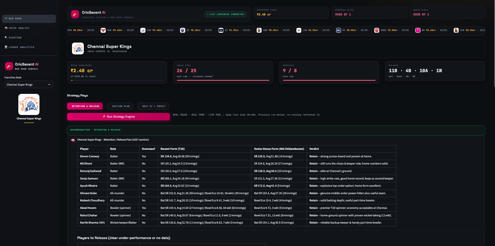
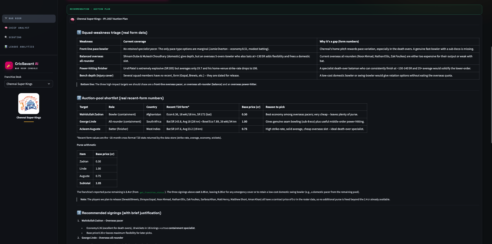
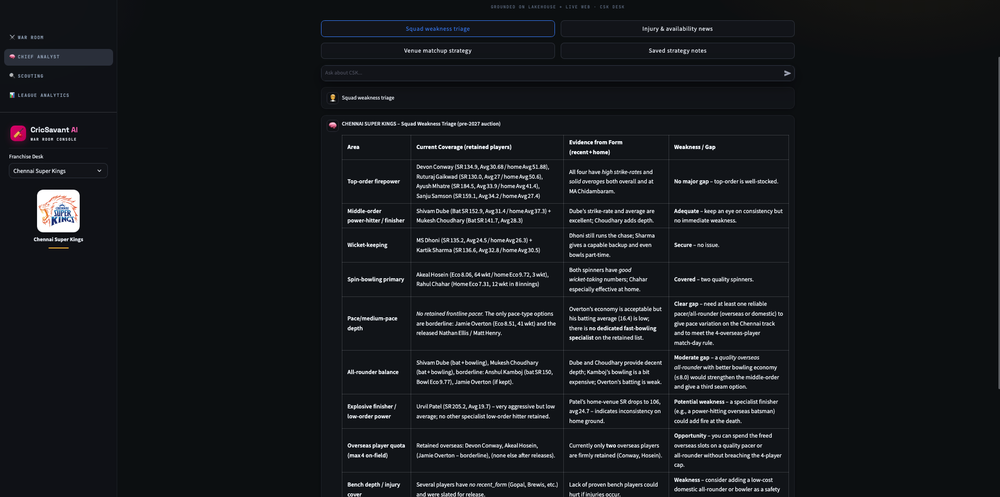

# CricSavant AI — Capstone Submission

**IPL Franchise Strategy Platform** · Databricks Free Edition

> ### 🔗 Live App
> **https://cricsavant-ai-7474650687479467.aws.databricksapps.com**

Architecture: see `ARCHITECTURE.md` · Setup/replication: see `SETUP.md` · Screenshots: `docs/screenshots/`

## Screenshots (live app)

*War Room — franchise desk, live league ticker, cap-breach flags, strategy plays.*

*The Auction Plan play: AI-built weakness triage, shortlist with real base prices, and purse arithmetic (₹2.05 cr of ₹2.40 cr available) — every figure from tool calls, not model memory.*

*Chief Analyst answering a squad question with grounded, cited analysis.*

Also in `docs/screenshots/`: `chief_analyst.png` (welcome state), `scouting.png`, `league_analytics.png`.

## The product in one paragraph

Every IPL franchise walks into an auction with gut feel and spreadsheets.
CricSavant is the war room: the franchise's real squad, 18 years of
ball-by-ball data, live news, and an AI Chief Analyst that builds the
retention plan, the auction shortlist, and the matchday XI — grounded in
numbers it shows you (every answer exposes its tool calls), saved to a
strategy notebook, downloadable as documents you carry into the auction.

## Capstone requirement map

| # | Requirement | Where it lives |
|---|---|---|
| 1 | Spark medallion pipeline | Notebooks 010–012: bronze (raw Cricsheet JSON + player registry) → silver (typed deliveries/matches/players) → gold (KPI profiles, venue form) in Unity Catalog `cricsavant` |
| 2 | Third-party API | Tavily Search API (notebook 005) fetches real news per pooled player |
| 3 | Unstructured data | News articles embedded → Databricks Vector Search index; agent retrieves + cites URLs |
| 4 | Databricks App frontend | Streamlit war-room console, 4 pages, service-principal auth (`app/`) |
| 5 | AI agent with retrieval + write tools | 7-tool agent on FMAPI (`databricks-gpt-oss-120b`): 5 retrieval + `save_strategy_note` (write) + `list_strategy_notes`; grounding rules in system prompt |
| 6 | Lakebase CDF → Delta | `change_log` (append-only, fed by every tool call and saved plan) synced by notebook 001 into `ops.lb_change_log_history`; audit strip on League Analytics |

## Development stages

### Stage 0 — Environment validation
Spiked every Free Edition capability the plan depended on before building:
serverless Spark, SQL warehouse, Lakebase provisioning, Vector Search,
FMAPI model list, Databricks Apps runtime. Established the
executor/architect working model (all code runs in the workspace; no
credentials ever leave it) and the secrets pattern (Databricks secrets via
widget-driven setup notebooks; nothing committed).

### Stage 1 — Medallion pipeline
Cricsheet ball-by-ball JSON for 9 competitions (2008–2025) ingested to
bronze with a registry-based `player_id` carried through every layer.
Silver: exploded, typed delivery/match/player tables. Gold: per-player
batting/bowling profiles blending recent (~18 months) vs career form,
phase splits (powerplay/middle/death), situational strike rates, venue
form with a 60-ball qualification floor, and percentile-based role
classification. Key data-reality lesson: Cricsheet stores names
inconsistently ("Sikandar Raza" but "JJ Bumrah"), which later forced a
shared fuzzy-matching rule across the whole product.

### Stage 2 — News RAG
Tavily integration fetching real articles for pooled players; embedding
pipeline into a Vector Search index. Agent-side tool must cite source URLs
— retrieval is evidence, not decoration.

### Stage 3 — Operational store (Lakebase)
Postgres schema for franchises, rosters, the real 369-player BCCI auction
shortlist, append-only `change_log`, and later `strategy_notes`.
Least-privilege role `cricsavant_app` (no DELETE anywhere; UPDATE only on
the purse column). Real IPL 2026 rosters (248 players) and post-auction
purses researched and seeded with citations; real home venues added for
venue-fit analysis. CDF requirement satisfied by an auditable
change_log→Delta sync.

### Stage 4 — The agent
OpenAI-compatible tool-calling loop on FMAPI. Grew from 4 tools to 7:
form profile (fuzzy match), news search, franchise status, venue-aware
retention analysis, auction-target finder, and the strategy-notes
write/read pair (which replaced practice bidding as the write action when
the product pivoted to strategy). Model journey: Llama 3.3 70B → judged
too shallow for multi-step squad reasoning → `databricks-gpt-oss-120b`
(strongest tool-caller on Free Edition; required normalizing
reasoning-model content blocks). Guardrails: never state stats from
memory, surface name collisions, honest null handling, purse math on
every recommendation.

### Stage 5 — The app
Streamlit on Databricks Apps. Three connection paths, each proven in an
integration spike before the UI was built: SQL warehouse (service
principal), Lakebase (pg8000 + password resource), FMAPI/Vector Search
(explicit SP auth). The product pivoted mid-build from an auction-bidding
toy to a **franchise strategy platform**: one-click strategy plays
(Retention & Release, Auction Plan, Best XI + Impact Player), a
persistent downloadable strategy notebook, full-universe scouting, league
analytics, and a continuous Chief Analyst chat sharing memory with the
plays. Design converged through user-driven iterations to a war-room
console: near-black, mono micro-labels, magenta CTAs, real team logos,
franchise-colored ambient accent.

### Stage 6 — Hardening (live-testing loop)
Every fix below came from testing the deployed app, not code review:
- **NaN crash** (`int(NaN)` on missing gold metrics) → `safe_num()`, pd.isna-aware.
- **Full-name search misses** ("Jasprit Bumrah" vs stored "JJ Bumrah") → surname+initial fallback in the agent's search tool.
- **Franchise context ignored** in chat → active-desk context injected per turn; team switch resets agent memory.
- **Bowlers labeled by batting stats** → role-priority stat selection; agent tool now returns both disciplines.
- **Vanishing AI results** (inline renders lost on rerun) → all results persisted in session state.
- **Silent run failures** → loud error surfacing.
- **Delete-blocked seeding** → idempotent UPDATE-or-INSERT (kept least privilege intact).
- Chart/contrast/layout fixes found via live scans (hidden axis labels, clipped bar labels, emoji-less canvas grids, over-cap chips reading "-1").

## Honest limitations & roadmap
- Gold "recent form" ends at Cricsheet's 2025 coverage; the just-played
  2026 season isn't reflected yet (top roadmap item).
- `is_overseas`/role for a few seeded players are best-effort inferences,
  flagged as such in the seeding notebook.
- Roadmap: 2026 season ingest, player comparison + target lists,
  captaincy/news angles, scheduled news refresh.

## Repository layout

| Path | Contents |
|---|---|
| `app/` | Databricks App (Streamlit): `app.py`, `lib/` (agent, lakehouse, lakebase, vector_search, charts, styles, utils), `assets/team_logos/`, `app.yaml`, `.streamlit/` |
| `notebooks/` | 001–014: setup, sync, ingest, pipeline, embeddings, seeding, agent spikes |
| `sql/` | Lakebase DDL + grants (001–008) |
| `docs/screenshots/` | App screenshots for this submission |
| `ARCHITECTURE.md` / `SETUP.md` / `SUBMISSION.md` | This document set |
